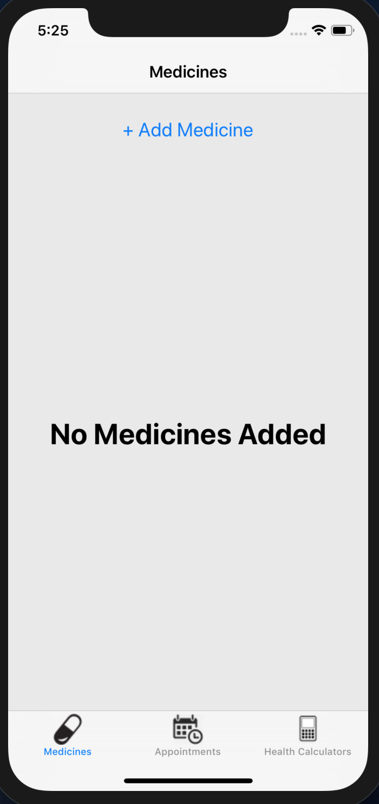
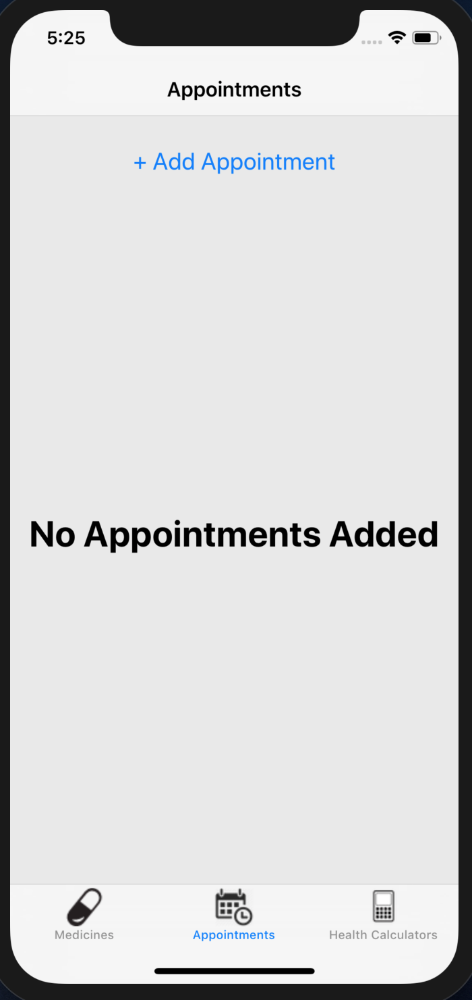
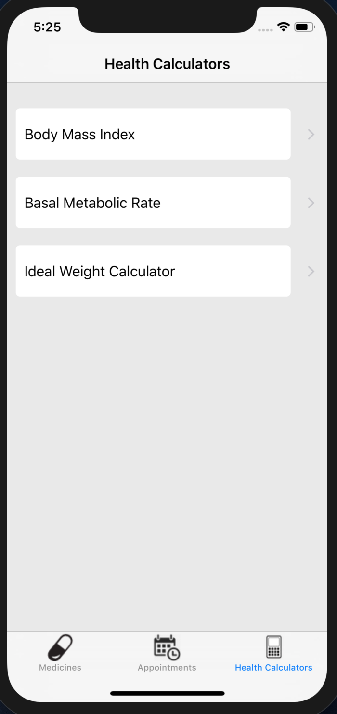
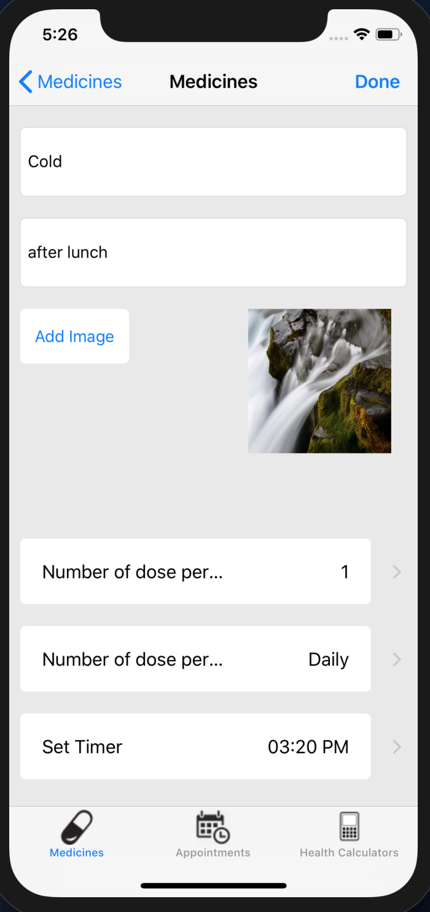
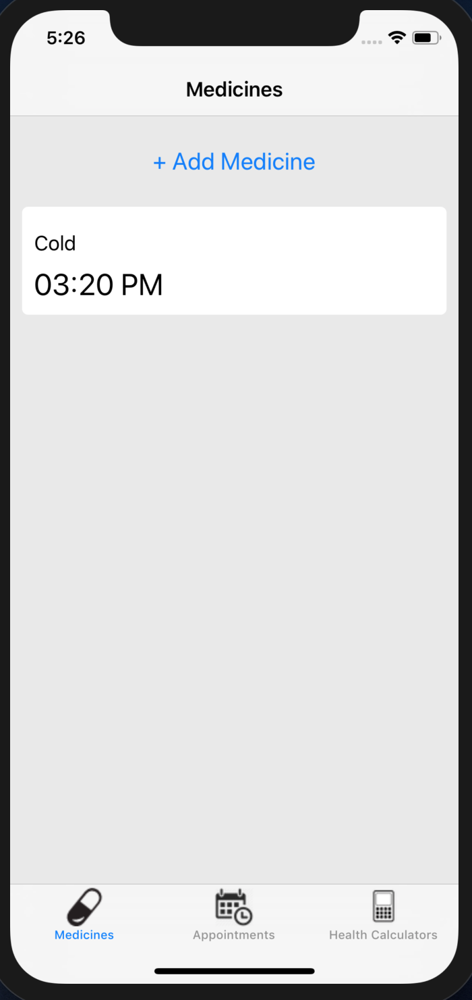
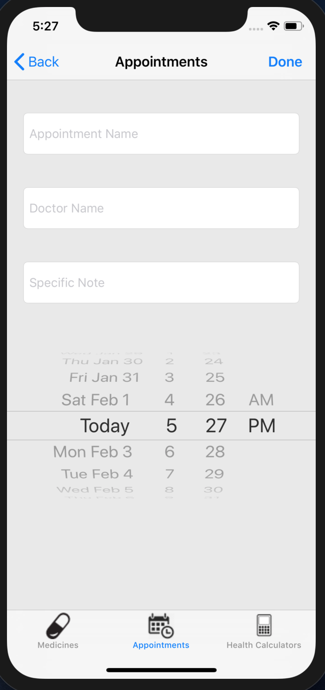
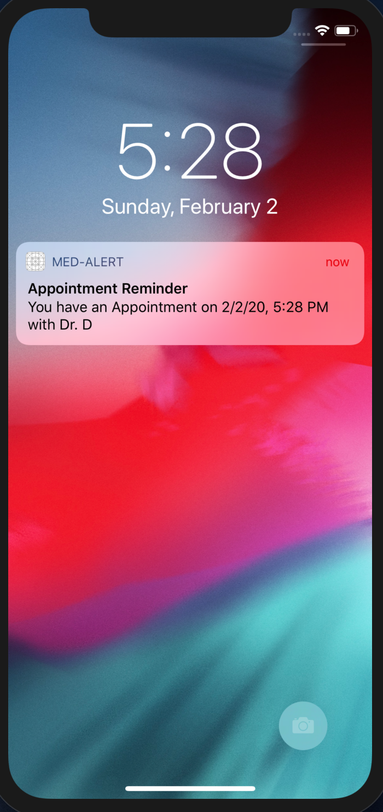
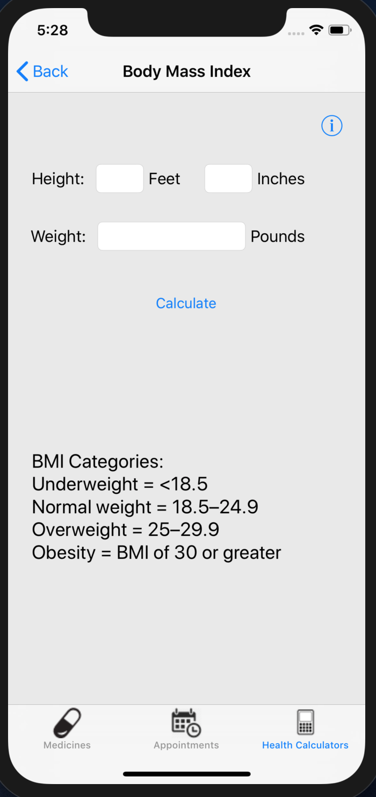

# Med-Alert (IOS Swift)
IOS app that add medicine reminders and doctor's appointment and get notification on given date and time. Three health calculator measures BMI, BMR and Ideal health calculator.

# Features
•	Add Medicine reminder 

•	Set alarm, days, weekday and number of dosage 

•	Set doctor’s appointment 

•	Check BMI, BMR and Ideal weight calculator

•	Get notification for medicine and doctor’s appointment 

•	User Friendly Design

•	Build with Swift

# Requirements
• Ios 12

# Screenshots

